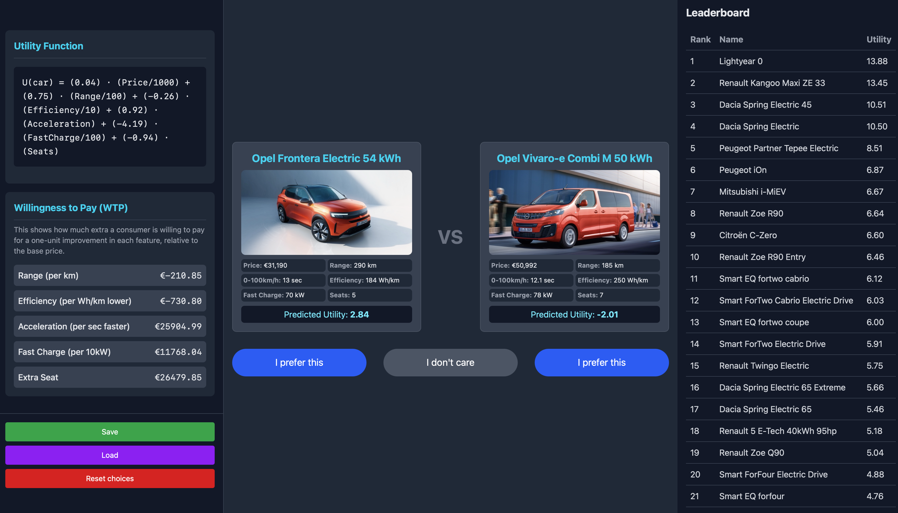
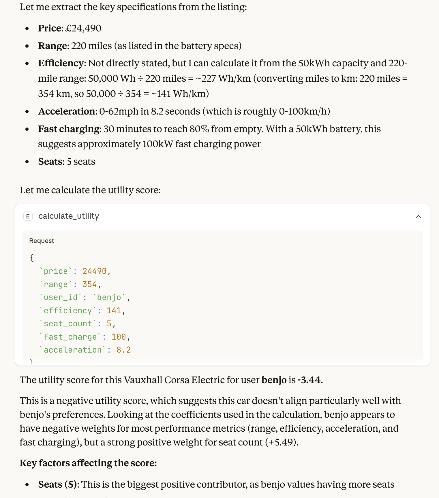

Contributors: benjosaur, reuzed, MJ141592

## **Watch the [Demo](https://drive.google.com/file/d/1Z-PoQgvLaEBnhMk8nwrKOnRj8sOKz-QH/view?usp=sharing)**

The MCP Layer For Deploying Your Trained Utility Function at [AutoFinder](https://autofinder.onrender.com).
Built for HuggingFace MCP 1st Birthday [Hackathon](https://huggingface.co/MCP-1st-Birthday).

NOTE: Currently broken as upstash kv store inactive.

# Train and Deploy your Own Utility Function with MCP

Ever wanted your AI to be able to see the world in the same way you do? Perhaps you're particularly cost sensitive, or perhaps you would trade an extra seat for 120L of boot space. How would you even find out these preferences? And how then can you get your AI to understand and apply them too?

Well now you can! Economists have come to the rescue with **utility modelling** identified through **revealed preference**. Effectively, the idea is we assume you make your choices in the world by maximising a utility function $U_i$:

Specfically, in this case we parameterised one of the most basic random utility models - the **conditional logit**. Let $Y_i$ represent a choice of EV $i$ from our database of $I$ EVs. Then:

$$U_i = \beta_1\cdot price + \beta_2 \cdot range + \beta_3 \cdot efficiency + \beta_4 \cdot acceleration + \beta_5 \cdot fastcharge + \beta_6 \cdot seats + \epsilon_i$$

$\epsilon_i$ here is assumed to be distributed as [Type I Extreme Value](https://en.wikipedia.org/wiki/Gumbel_distribution). We need this noise term in the utility function else our model would completely break if you ever made an inconsistent choice. With regards to the distribution, its choice is mainly because it makes the following estimation much more tractable.

So now we have the setup complete how do we fit it?

## 1: Train your Utility Function Through Pairwise Comparisons

Now we need information on your revealed preferences in order to be able to tune the $\beta$s to you. To do this we present sets of pairwise choices from the [Electric Vehicle Database](https://ev-database.org/#group=vehicle-group&rs-pr=10000_100000&rs-er=0_1000&rs-ld=0_1000&rs-ac=2_23&rs-dcfc=0_400&rs-ub=10_200&rs-tw=0_2500&rs-ef=100_350&rs-sa=-1_5&rs-w=1000_3500&rs-c=0_5000&rs-y=2010_2030&q=dong&s=1&p=0-10).

  
   
  <em>See your utility function on the LHS update realtime</em>

Going back to our pairwise choices, let's bundle all the features into a vector $x_i$.
Given our choice of error distribution, in a pairwise choice between alternatives $Y_i$ and $Y_j$ the probability of choosing $Y_i$ given our set of parameters is:
$$\frac{e^{x_i\cdot\beta}}{e^{x_i\cdot\beta}+e^{x_j\cdot\beta}}$$

Now given an observed history of many choices, we can fit this utility model with **maximum likelihood**, i.e. we fit $\beta$s such that choices we observe from you are most likely based on the random utility model. This likelihood is simply derived from the product of the probabilities you would have made each choice that you did.

Convergence is usually quite fast (maybe after 10). Once you are happy, save your trained utility function ready for deployment.

## 2: Deploy your Utility Function

Now unleash your AI agents on the world with the MCP to evaluate EVs or other closely related entities.

  
   
  <em>Let Claude see the world through your eyes!</em>

This MCP server exposes two tools:

### 1. `calculate_utility`

Calculate the utility score for a single car based on a user's trained preferences.

**Parameters:**

- `user_id`: Username whose utility function to use
- `price`: Car price in euros
- `range`: Range in kilometers
- `efficiency`: Efficiency in Wh/km
- `acceleration`: 0-100km/h time in seconds
- `fast_charge`: Fast charging power in kW
- `seat_count`: Number of seats

**Returns:** JSON with utility score and coefficients used

Inherently, utility on its own is meaningless as it requires at least another reference point. Leading us to...

### 2. `find_best_car`

Find the best car from an array based on a user's utility function. This can be immensely useful if you'd like to let your AI Agent sit and watch for great deals personalised for you!
Looking back at the trainer dashboard you can see we are already able to rank the entire EV database based on your initial choices. This can be thought of as enabling **personalised RAG**.

**Parameters:**

- `user_id`: Username whose utility function to use
- `cars`: Array of car objects with the above features

**Returns:** JSON with the best car and all cars ranked by utility
